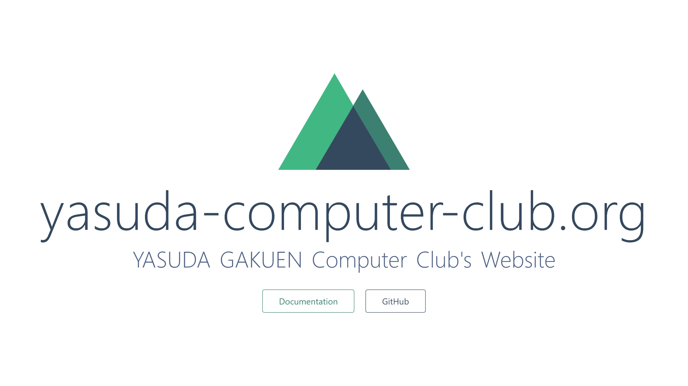

東京都墨田区横網2-2-25 に所在する [安田学園](http://yasuda.ed.jp/) のコンピュータークラブでは、初歩的なプログラミングからゲーム作り、情報オリンピックへの参加などの活動をしております。その活動の一環としてこのホームページを作成しました。

# 見出しレベル1

## 見出しレベル2

### 見出しレベル3

#### 見出しレベル4

##### 見出しレベル5

###### 見出しレベル6

+ ほげ
+ ふが
    + ぴよ
    + ほげほげ
        + ふがふが
    + ぴよぴよ


1. ほげ
1. ふが
    1. ぴよ
    1. ほげほげ
        1. ふがふが
    1. ぴよぴよ

> 引用
> 引用
>> 二重引用
>> 二重引用

    # Space
    window.addEventListener("DOMContentLoaded", () => {
        // ここに処理
    });

モジュールを読み込むには `require` を使います。

アスタリスクかアンダースコアで囲むと *強調(斜体)* されます。

アスタリスクかアンダースコア2つで囲むと **強調(太字)** されます。

アスタリスクかアンダースコア3つで囲むと ***強調(斜体・太字)*** されます。

水平線

---

チルダ二つで囲むと ~~取り消し線~~ が引かれます。

~~~
window.addEventListener("DOMContentLoaded", () => {
    // ここに処理
});
~~~

```javascript
window.addEventListener("DOMContentLoaded", () => {
    // ここに処理
});
```

|header1|header2|header3|
|:--|--:|:--:|
|align left|align right|align center|
|a|b|c|




